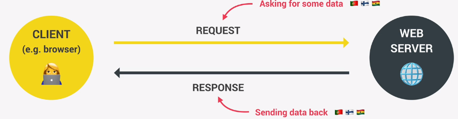

# Asynchronous JavaScript, AJAX and APIs

## Asynchronous JS

Long running tasks that run in the background, e.g fetching data from servers using so called 'AJAX' (asyncrhronous javascript and XML) calls.

Synchronous code is executed line by line and each line of code waits for previous line to finish executing. 

Some long running operations break the execution of code, e.g an ```alert()`` method:

```javascript
let p = document.queryselector('p');
p.style.color = "red";
alert('paragraphs are red');
p.style.color = "green";
```

The ```<p>``` won't change to green until the alert window is clicked by the user, so it is a long running operation. This blocks the execution of additional code, which isn't always ideal.

*Asynchronous* code solves this problem by allowing code to run in the background, while the rest of the script executes.

## Asynchronous example:

A ```timeout``` function is an example of asynchronous code. It is **non blocking** 

```javasript
setTimeout(function() {
    console.log('goodbye');

}, 5000);

console.log('hello');
```

In this example 'hello' is printed to the console 5 seconds before 'goodbye' is. That's is because the callback function is asynchronous, meaning it is non-blocking and runs in the background.

> NOTE: not all callback functions are asynchronous by nature. Only certain functions, like setTimeOut work in an asynchronous way. 


## AJAX (asynchronous javascript and xml)

AJAX allows us to communite with remote web servers in an asynchronous way. This helps request data from web servers dynamically. For instance, we can make a call for data, which will run asynchronously in the background, without blocking synchronous code. 





Client sends request to server, which responds with data. This happens asynchronously, without blocking synchronous code.

The web server usually has an API, where we get out data. 

## API (application program interface)

An API is a piece of software that allowed communication between two different programs to exchange data. Examples:

1. **DOM API**: Allows developers to interact with the Document Object Model.
2. **Geolocation API**: Allows developers to access geographical information. 
3. **"Online API" / API / web API**: Most important for our purposes. Runs on a web server that received requests for data and sends back data as a response to the client. 

Building your own web API required backend and database software (Node.js etc).

> While X in AJAX stands for XML (CML being a data format), XML is hardly ever used anymore. Instead we use the JSON data format. However, the AJAX name remains.