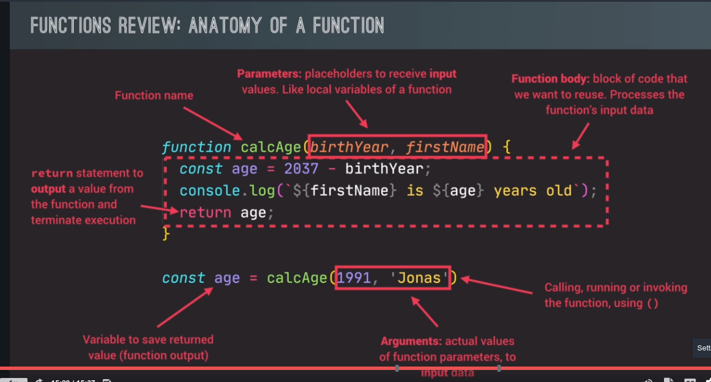

# Functions 

* Multiple ways to write functions: expressions, declarations and arrow functions. Three different types:

```javascript
function calcAge(birthYear) {
    return 2037 - birthYear;
}

const calcAge = function(birthYear) {
    return 2037 - birthYear;
}

const calcAge = birthYear => return 2037 - birthYear;

```

* **Declaration**: Is hoisted and can be used before it is declared
* **Expression**: Is an expression stored in a variable. It is not hoisted and cannot be used before it is declared
* **Arrow function**: Ideal for one-line functions. Has no 'this' keyword and for single lines it has an implied ```return``` keyword.


* The ```return``` statement immediately returns or 'exits' the functions.
* All functions receive **input** data, **transform** data and **output** data.

## Function anatomy

* Name
* Parameters
* Function body
* Return statement
* Calling, running of invoking using ()
* Arguments


