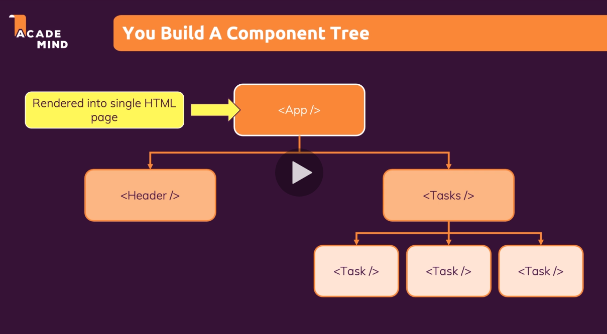

# React project structure

## Index.js

This is the first file that is initially executed on the page.

Out of the box the code we have in a starter project won't run in your normal browser, for instance importing a .css file into an index.js file just wouldn't work:

```js
import "./index.css";
```

This is only made possible by the npm scripts running the background, initialised with `npm init`1..

Similarly:

```js
ReactDOM.render(<App />);
```

This is transformed before it is delivered by the browser.

## What is in index.js?

```js
import ReactDOM from "react-dom";
```

This is importing the ReactDOM object from one of our project's dependencies, which comes from a 3rd party library. The `react-dom` package, along with the `react`package form the React framework, largely.

Once the file, in this case `ReactDOM` is imported into `index.js` then we can use it, for instance, calling a method on the ReactDOM object:

```js
ReactDOM.render(<App />);
```

## public/index.html file

The `render` function takes two arguments, the second being where in the DOM we want to pass the first argument. In this case it is the JS ID selector:

```js
document.getElementById("root");
```

The <root> element is made accessible through the index.html file in the /public/ folder. This file is not commonly altered and forms the basis of the 'Single Page Application' functionality of React.

All actions are taken on a single html page, in this case the index.html file.

In this case, what is inside the #id div should be replace with the contents of the <App />. The App element itself is also imported into the index.js file:

```js
import App from "./App";
```

> All third party and self-written .js files don't need to have the .js file extension added when being imported. All other files (css, for instance) require the file extension.

## App.js

Consider the App.js file as the root component, it doesn't require it's own folder necessarily, unlike all other components.

All other components can be funnelled through the App.js file, as the App.js file works as a wrapper for the whole project, usually.

## Component tree

It's common practice to give components their own file, and to organise them into folders accordingly.



## File naming conventions

ExpenseItems.js, it's like camelcase, but with the first letter capitalised.

Functions within the file should similarly be named:

```js
function ExpenseItem() {
  return <h2>Expense item</h2>;
}
```
