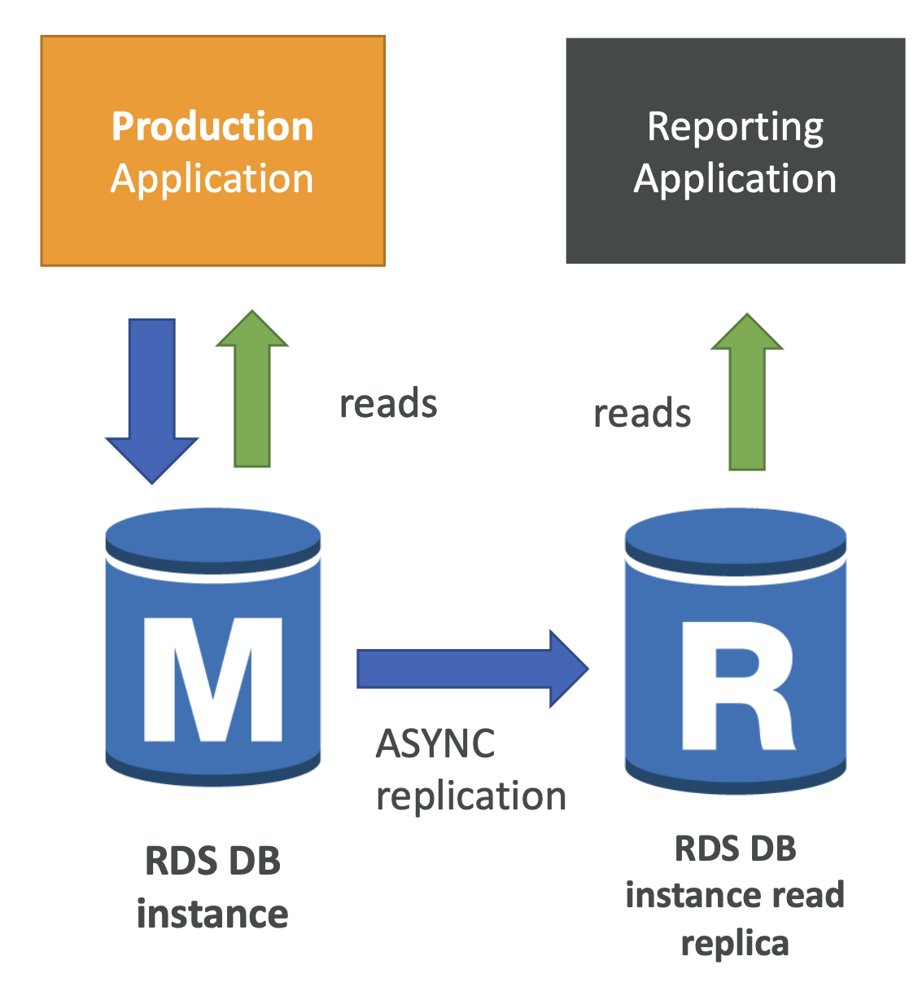

# Relational Database Services (RDS)

- RDS is a managed database service from AWS
- It uses SQL and supports the following databases:

1. Postgres
2. MySQL
3. MariaDB
4. Oracle
5. Microsoft SQL server
6. IBM DB2
7. Aurora (AWS proprietary service)

## Why use a managed service?

AWS manages the whole service for you, including deployment of databases onto infrastructure. Because it's managed, you don't have access to the underlying infra, so you can't SSH into the DB servers. 

Advantages of this:

- Automated provisioning, OS patches
- Backups 
- Monitoring dashboards
- Scaling (horizontal and vertical)
- Multi AZ (recovery)
- Read replicas (performance)

## Storage Auto Scaling

AWS can scale DB stores automatically depending on usage. For e.g when you are running out of DB space.

You have to set a **Maximum Storage Threshold**. 

> Auto scaling is good for apps with unpredictable DB operations## Storage Auto Scaling

## Read Replicas VS Multi AZ

### Read Replicas

Read replicas are DB replicas of the main DB that allow for more read operations (scalability). 

They work by replicating the main DB and then allowing read operations to those replicas. 

The data between the main DB and replica DBs is *eventually consistent*, meaning that they will eventually have identical data, but there is a chance a read operation to a replica will receive back outdated data. 

Replicas can also be promoted to their own DB.

#### Network Costs for replicas

There are network costs associated with replicas. If you replicate across a different AZ, a fee is incurred, else it's free. 

### Multi AZ

Multi AZ RDS are DB instances that are on standby should something go wrong with the master DB. 

This helps increase availability

> Multi AZ RDS is good for database availability

There is just one DNS name needed and if there is network loss, instance of storage failure, read and write operations will be passed to the instance on standby:

**There is no downtime associated when creating Multi AZ - you just modify the DB**

> Important to know that you can also use read replicas for Disaster Recovery (DS)

