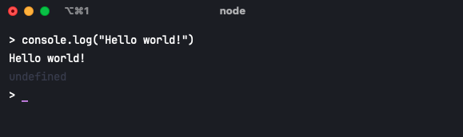

# Building CLI tools with Node.js

All the notes below are based off the course [here](https://nodecli.com/).

The CLI is a useful tool to optimise daily programming tasks. For example, i've been writing bash scripts to automate some daily tasks such as setting up express servers, copying dates for Salesforce notes etc.

But Bash is kind of ugly, why not use the language you are most used to?

## Node.js for CLIs

Node.js is a JS run time, meaning it can run outside of browser environments. It just so happens that you can run Node.js scripts in the terminal.

If you open up your terminal and run `node` you will enter the Node REPL (Read, Evaluate, Print Loop) where you can run JS right in the terminal window:

Therefore, we can utilise JS and everything it provides us, including all NPM packages in order to built fully fledged Node CLI tools.

That's what these notes will be about.
